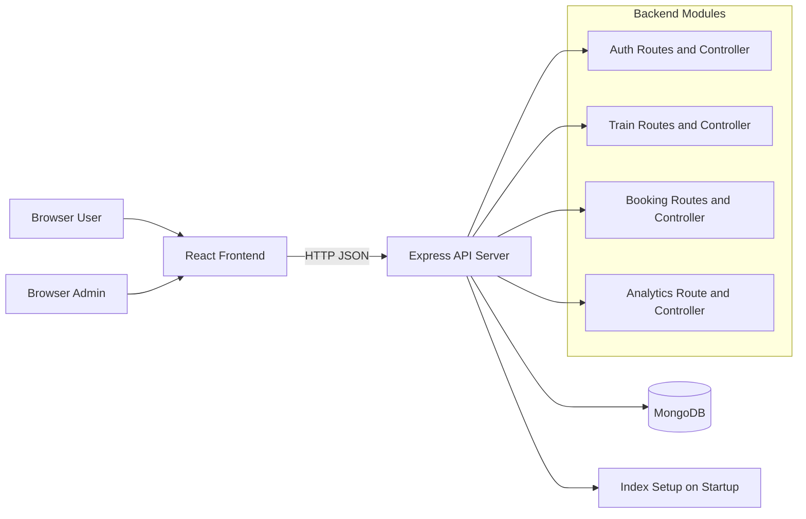
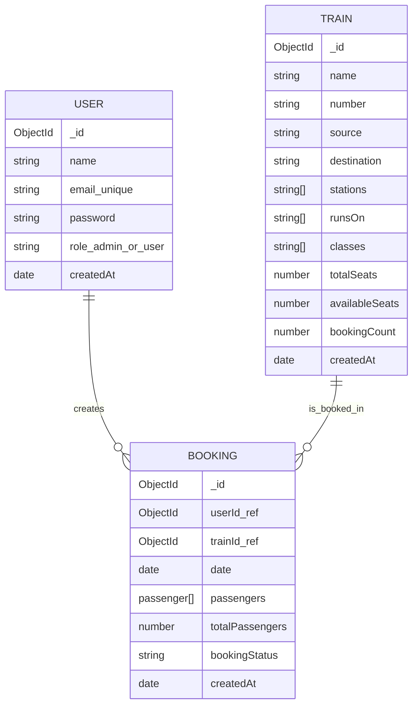
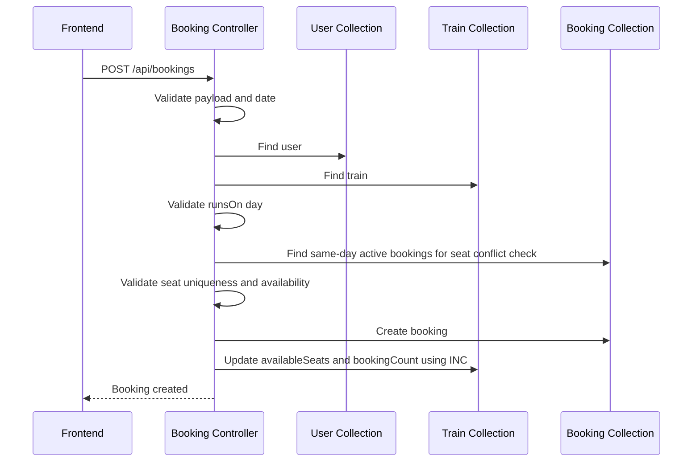
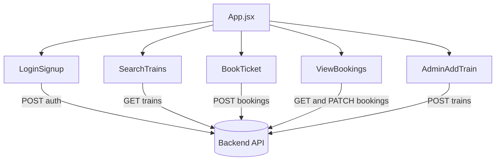
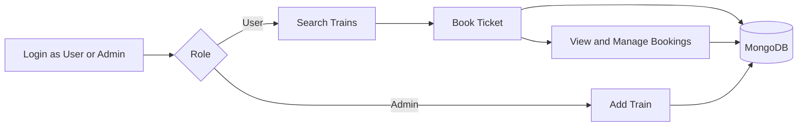

# Railway Management System - Complete Technical Documentation

## 1. Project Summary

This project is an IRCTC-style Railway Management System built for MongoDB learning.
It is intentionally simple and backend-focused, while still enforcing realistic booking and seat consistency logic.

Key goals:

- Demonstrate practical MongoDB CRUD queries and operators in a full workflow.
- Keep architecture and logic easy to understand for course/demo use.
- Avoid complex aggregation and overengineering.

Out of scope:

- JWT authentication and sessions
- Payment integration
- Waitlist and seat-locking concurrency systems
- Microservices and distributed architecture

## 2. Technology Stack

Backend:

- Node.js
- Express 5
- Mongoose
- MongoDB (local)
- CORS and dotenv

Frontend:

- React (Vite)
- Axios

Tooling:

- ESLint for frontend linting
- Nodemon for backend development

## 3. High-Level Architecture



## 4. Repository Structure

```text
mongodb_project/
  backend/
    config/
      db.js
      indexSetup.js
    controllers/
      authController.js
      trainController.js
      bookingController.js
      analyticsController.js
    models/
      User.js
      Train.js
      Booking.js
    routes/
      authRoutes.js
      trainRoutes.js
      bookingRoutes.js
      analyticsRoutes.js
    scripts/
      seedDemoData.js
    server.js
    .env.example
  frontend/
    src/
      api/
        client.js
      pages/
        LoginSignup.jsx
        SearchTrains.jsx
        BookTicket.jsx
        ViewBookings.jsx
        AdminAddTrain.jsx
      App.jsx
      App.css
```

## 5. Runtime Configuration

Backend environment variables:

- PORT (default: 5000)
- MONGO_URI (default fallback: mongodb://127.0.0.1:27017/railway_management)

Frontend environment variables:

- VITE_API_BASE_URL (default fallback: http://localhost:5000)

## 6. Backend Boot Sequence

1. Load environment variables.
2. Create Express app.
3. Enable CORS and JSON body parsing.
4. Register routes:
   - /api/auth
   - /api/trains
   - /api/bookings
   - /api/analytics
5. Connect to MongoDB.
6. Ensure required indexes using explicit createIndex calls.
7. Start server.

## 7. Data Model Design

### 7.1 ER Diagram



### 7.2 User Schema

Fields:

- name: required string
- email: required, unique, lowercase
- password: required string (plain text for demo only)
- role: enum admin or user (default user)
- createdAt: default Date.now

### 7.3 Train Schema

Fields:

- name, number, source, destination: required strings
- stations, runsOn, classes: string arrays
- totalSeats: required number, min 0
- availableSeats: number, min 0
- bookingCount: number, default 0, min 0
- createdAt: default Date.now

Hooks and safeguards:

- pre-validate sets availableSeats to totalSeats when missing.
- pre-validate caps availableSeats to totalSeats if it exceeds.

Indexes:

- { source: 1, destination: 1 }
- { stations: 1 }
- { runsOn: 1 }
- { classes: 1 }

### 7.4 Booking Schema

Fields:

- userId: ObjectId ref User, required
- trainId: ObjectId ref Train, required
- date: required Date
- passengers: array of embedded passenger objects
- totalPassengers: required number, min 0
- bookingStatus: enum confirmed or cancelled
- createdAt: default Date.now

Passenger embedded object fields:

- name: required string
- age: required number, min 0
- gender: required string
- seatNumber: required string
- status: enum confirmed or cancelled, default confirmed

Indexes:

- { trainId: 1, date: 1 }
- { userId: 1 }

## 8. API Endpoint Catalog

Base URL:

- http://localhost:5000

### 8.1 Health

- GET /
  - Purpose: API health response
  - Response: { message: Railway Management API is running }

### 8.2 Authentication

- POST /api/auth/signup
  - Body:
    - name (required)
    - email (required)
    - password (required)
    - role (optional, default user)
  - Success: 201
  - Errors:
    - 400 missing required fields
    - 409 email already exists

- POST /api/auth/login
  - Body:
    - email (required)
    - password (required)
  - Success: 200 with user projection (name, email, role, createdAt)
  - Errors:
    - 400 missing input
    - 401 invalid credentials

Note:

- Authentication is demo-style equality matching without JWT.

### 8.3 Trains

- POST /api/trains
  - Access control: body role must be admin
  - Body:
    - role, name, number, source, destination, totalSeats required
    - stations, runsOn, classes optional arrays
    - availableSeats optional, defaults to totalSeats when absent
  - Success: 201 Train added
  - Errors:
    - 403 non-admin role
    - 400 invalid seat values or missing fields

- GET /api/trains
  - Query parameters:
    - source
    - destination
    - station
    - day (CSV, uses IN behavior)
    - class (CSV include)
    - excludeClass (CSV exclude)
    - allClasses (CSV all required)
    - sourceNot
    - destinationNot
    - minSeats
    - maxSeats
    - stationsExists (true or false)
    - keyword (case-insensitive match in name/source/destination)
  - Success: 200 with count and trains projection

### 8.4 Bookings

- POST /api/bookings
  - Body:
    - userId
    - trainId
    - date in YYYY-MM-DD
    - passengers[] non-empty
  - Booking validations:
    - user must exist
    - train must exist
    - date must be valid and not in past
    - train must run on selected day
    - passenger data must be valid
    - seat numbers normalized to uppercase
    - no duplicate seats in request
    - no conflicting seats already booked for same train/date
    - enough seats must be available
  - Success: 201 Booking created
  - Important update side effects:
    - Train.availableSeats decreases by passenger count
    - Train.bookingCount increments by 1

- GET /api/bookings
  - Query parameters:
    - userId
    - trainId
    - status
    - statusOr (CSV for OR status filter)
    - date (single date range)
    - fromDate
    - toDate
    - minPassengers
    - maxPassengers
    - exactPassengers
    - passengerAgeMin
    - passengerAgeMax
    - sort (asc or desc on createdAt)
  - Output:
    - Populates trainId with name, number, source, destination
    - Populates userId with name and email
  - Success: 200 with count and bookings

- PATCH /api/bookings/:id/cancel
  - Behavior:
    - Sets bookingStatus to cancelled
    - Sets all passenger statuses to cancelled
    - Increases Train.availableSeats by confirmed passenger count
  - Success: 200

- PATCH /api/bookings/:id/passengers
  - Body:
    - passenger object or passengers array
  - Behavior:
    - Validates new passengers
    - Prevents duplicates in request
    - Prevents conflicts with current booking confirmed seats
    - Prevents conflicts with other bookings on same train/date
    - Ensures seat availability
    - Pushes passenger(s) and increments totalPassengers
    - Decreases Train.availableSeats accordingly
  - Success: 200

- PATCH /api/bookings/:id/remove-passenger
  - Body:
    - seatNumber
  - Behavior:
    - Pulls matching passenger
    - Decrements totalPassengers
    - If removed passenger was confirmed, increases Train.availableSeats
    - Auto-cancels booking if no passengers remain or all are cancelled
  - Success: 200

- PATCH /api/bookings/:id/passengers/:seatNumber/cancel
  - Behavior:
    - Sets one passenger status to cancelled
    - Increases Train.availableSeats by 1
    - Auto-cancels booking if all passengers become cancelled
  - Success: 200

### 8.5 Utility

- GET /api/analytics/indexes
  - Returns Train and Booking index metadata from MongoDB getIndexes.

## 9. Query and Operator Coverage

This project intentionally focuses on simple query composition and update operators.

### 9.1 Read Query Operators

Used in train and booking filters:

- EQ
- NE
- GTE
- LT
- LTE
- AND
- OR
- IN
- NIN
- ALL
- ELEM_MATCH
- EXISTS

Examples by feature:

- Source and destination search uses composed AND conditions.
- Multi-day and class filters use CSV parsing and IN behavior.
- Exclusion filters use NIN.
- Required class combinations use ALL.
- Age filtering in embedded passengers uses ELEM_MATCH.
- Booking date logic uses date windows with GTE and LT.
- Status OR filter uses OR from CSV statuses.

### 9.2 Write/Mutation Operators

Used for booking and seat consistency:

- SET
- INC
- PUSH
- EACH
- PULL

Examples:

- Cancel full booking uses SET on booking and passenger statuses.
- Seat and count adjustments use INC.
- Add passengers uses PUSH with EACH.
- Remove passenger uses PULL.

## 10. Booking and Seat Consistency Logic

### 10.1 Booking Creation Flow



### 10.2 Rules Enforced

- Journey date must be valid and non-past.
- Seat numbers are normalized to uppercase for consistency.
- Duplicate seat numbers in one request are rejected.
- Same seat cannot be confirmed in another active booking for same train and date.
- Booking allowed only on train running days.
- Full booking cancel frees all confirmed seats.
- Single passenger cancel/remove frees seat only when that passenger was confirmed.
- Booking auto-cancels when all passengers are cancelled or removed.

## 11. Role-Based Frontend Behavior

### 11.1 Role Matrix

- Not logged in:
  - Visible page: Login and Signup only
- User role:
  - Search Trains
  - Book Ticket
  - View Bookings
- Admin role:
  - Admin Add Train

### 11.2 UI Navigation and Access

The frontend enforces role-gated page rendering and also each page has in-page guard messages for unauthorized access.

### 11.3 Frontend Component Diagram



## 12. Frontend Features by Page

LoginSignup:

- Signup and login forms
- Role selection during signup
- Success and error messaging

SearchTrains:

- Multiple search filters
- Day and class checkbox groups with select-all and clear actions
- Uses query parameter mapping to backend

BookTicket:

- Dynamic passenger rows
- Multi-passenger booking creation
- Form reset after successful booking

ViewBookings:

- Rich filter panel for user bookings
- Per-booking actions:
  - Cancel full booking
  - Add passenger
  - Remove passenger
  - Cancel one passenger by seat

AdminAddTrain:

- Admin-only train creation
- Multi-select checkboxes for runsOn and classes

Styling:

- Custom CSS theme with cards, chip-style checkbox controls, responsive layout, and role badges.

## 13. Indexing Strategy

Indexes are defined in two places:

- Mongoose schema-level indexes in Train and Booking models
- Explicit startup createIndex calls in indexSetup.js for visibility and repeatable demo behavior

Index metadata endpoint:

- GET /api/analytics/indexes

## 14. Demo Data Seeding

Script:

- backend/scripts/seedDemoData.js

Behavior:

- Clears User, Train, Booking collections.
- Inserts fixed demo users and trains.
- Inserts realistic demo bookings.
- Recomputes and updates train bookingCount and availableSeats based on confirmed passengers.
- Prints credential table, train table, and booking table.

Run command:

- npm run seed:demo in backend

## 15. Request and Response Standards

General patterns:

- JSON request and response bodies
- Success responses include message and relevant data
- Error responses include message
- HTTP status handling:
  - 200 success read/update
  - 201 created
  - 400 validation errors
  - 401 invalid login
  - 403 role forbidden
  - 404 not found
  - 409 duplicate signup email
  - 500 server errors

## 16. Non-Functional Behavior

- Simplicity-first controller logic for educational readability.
- No MongoDB grouping or unwind aggregation used in active query paths.
- Consistency over optimization in seat-check logic.
- Frontend and backend contracts aligned for all current filters and actions.

## 17. Run and Build Commands

Backend:

- npm install
- npm run dev
- npm start
- npm run seed:demo

Frontend:

- npm install
- npm run dev
- npm run lint
- npm run build
- npm run preview

## 18. End-to-End Flow Diagram



## 19. Known Limitations

- Passwords are stored as plain text for demo simplicity.
- No session persistence or token-based authentication.
- No transactional locking for race-condition-safe booking under heavy concurrency.
- No payment or waitlist lifecycle.
- No pagination in listing endpoints.

## 20. Suggested Future Enhancements

- Add hashed passwords and JWT auth.
- Add pagination and optional projection controls for large data.
- Add booking transactions or optimistic locking for high concurrency.
- Add waitlist and auto-allocation rules.
- Add API documentation generation via OpenAPI.

---

This document is generated from the current implementation and reflects the active code behavior in backend and frontend modules.
